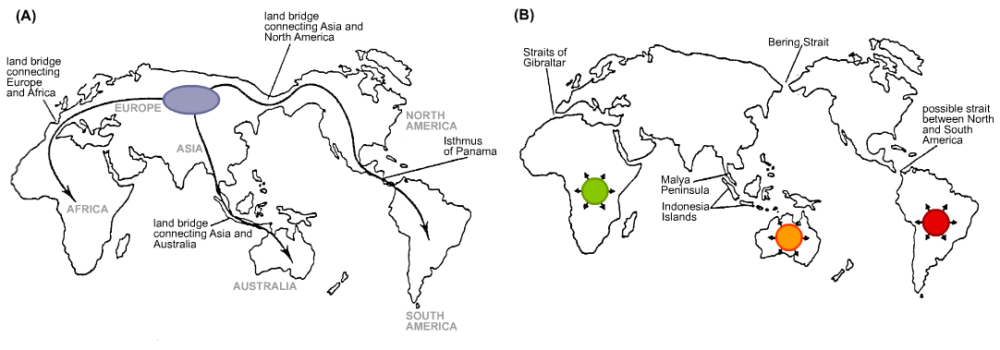

**Julian Reyes**

**Period 7**

**U.S. History**
# Chapter 1 : The 1st Americans
***The Settling of the Americas***

* 15,000 - 60,000 years ago
* Crossed across the Bering Strait via land bridge
* Evidence of Pacific crossing 14,000 years ago

***Indian Societies of the Americas***

* Aztec
* Maya 
* Inca

***Mound Builders of the Mississippi River Valley***

* Cahokia
* Near present day St. Louis, Missouri

***Western Indians***

* 